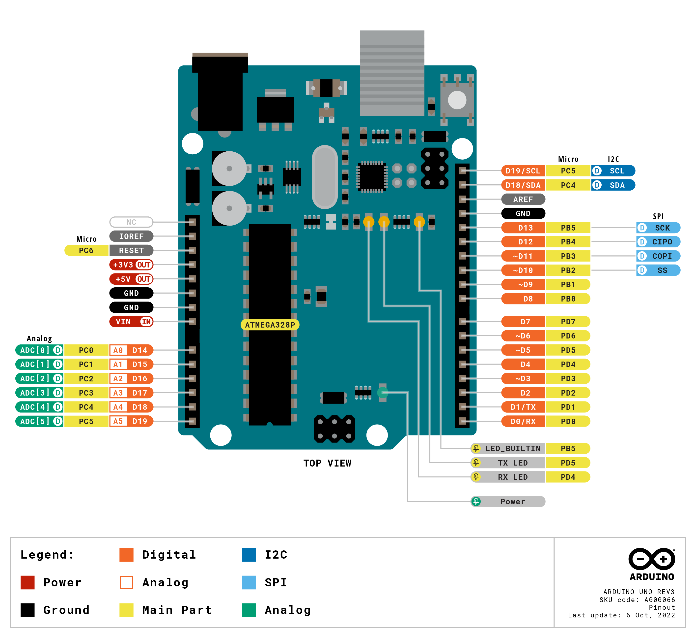

# Arquitetura do Sistema

A arquitetura apresentada a seguir refere-se à Sprint 1 e baseia-se nos conhecimentos adquiridos nas duas primeiras semanas do projeto.

O diagrama de blocos descreve as etapas cruciais para a solução da AACD, um projeto que possibilita que terapeutas ocupacionais desenvolvam jogos personalizáveis para pessoas com deficiência cognitiva e/ou motora.

A arquitetura de hardware descrita na imagem abrange nossa solução em relação ao fluxo de uso e às conexões necessárias.

## Diagrama de Blocos

## Descrição da Arquitetura

### 1. IDE
Por meio de uma IDE, a terapeuta ocupacional pode desenvolver gamificações para suas sessões. Com a programação em blocos, o usuário pode gerar um código capaz de passar por todas as etapas do compilador.

### 2. Compilador
O compilador é responsável por transformar o código gerado pelo terapeuta da linguagem Will para a linguagem Python. O arquivo em Python pode ser executado no computador do usuário, permitindo que o jogo seja executado.

O compilador é composto por quatro partes principais:

#### a) Analisador léxico
O analisador léxico é responsável por identificar e classificar os tokens no código-fonte. Ele analisa a sequência de caracteres e converte-a em uma série de tokens significativos, como variáveis, operadores e palavras-chave.

#### b) Analisador sintático
O analisador sintático verifica se a sequência de tokens segue as regras da linguagem de programação. Ele constrói uma árvore sintática que representa a estrutura do programa e verifica se essa estrutura está correta.

#### c) Analisador semântico
O analisador semântico verifica as regras de significado do programa. Ele garante que as variáveis sejam usadas de maneira apropriada, que as operações sejam compatíveis e que não ocorram erros de semântica no código.

#### d) Gerador de código em Python
O gerador de código em Python cria o código Python correspondente ao código Will analisado e validado. Ele traduz a estrutura e a lógica do programa para Python, garantindo que a funcionalidade do jogo seja preservada na conversão.

### 3. Tapete Sensorial
O tapete sensorial é a entrada do nosso usuário. Através de diferentes estímulos sensoriais, a criança pode reconhecer diferentes texturas e cores e interagir com o jogo desenvolvido pela terapeuta.

Devido às limitações de conhecimento na Sprint 1, os conectores e componentes eletrônicos que compõem o tapete não foram especificados. No entanto, esses detalhes serão abordados em entregas posteriores.

### 4. Greg Maker - Arduino R3
Por meio de conexão USB, os sensores são conectados para transmitir informações ao [Greg Maker](https://www.gregmaker.com.br/). O Greg Maker é responsável por transformar esses sinais analógicos em entradas de teclado e mouse no computador.

Como mencionado anteriormente, as informações de entradas e saídas ainda são limitadas, mas podem ser obtidas por meio da documentação do [Arduino Uno R3](https://docs.arduino.cc/hardware/uno-rev3) - a placa que compõe o projeto.

A imagem acima descreve todas as portas disponíveis na placa do Arduino Uno R3. No entanto, a placa do Greg Maker provavelmente terá um número reduzido de entradas. Uma descrição mais detalhada da placa será fornecida em sprints posteriores, à medida que adquirirmos mais conhecimento sobre o equipamento.

### 5. Computador
Toda a plataforma IDE, assim como o compilador integrado, é executada no computador da terapeuta ocupacional. A conexão com o Greg Maker também ocorre no computador da terapeuta. Portanto, o computador desempenha um papel fundamental, unindo a execução da IDE e a integração com o tapete sensorial.

