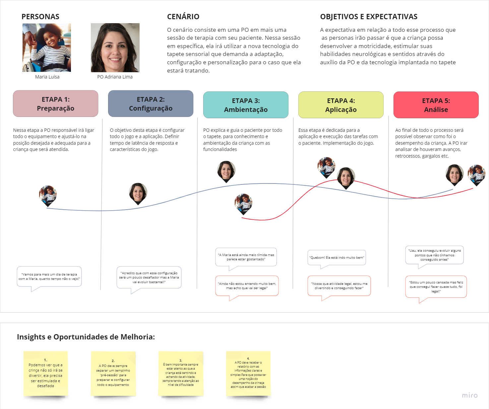

# Entendimento da Experiência do Usuário

## 1. Personas

Para a concepção da solução, tornou-se essencial a criação de duas personas: Maria Luísa e Adriana Lima, visando atender e abranger um público mais diversificado.

O tapete sensorial será uma ferramenta de interação para Maria Luísa, uma criança de 6 anos com diplagia (falta de movimento nas pernas), com o propósito de explorar novas tecnologias enquanto avança em seu processo terapêutico.

Adriana Lima, na função de terapeuta ocupacional responsável por Maria, desempenhará a tarefa de sugerir o uso do tapete, personalizar os jogos e monitorar o progresso da paciente.

## 2. User Stories

Foram criadas oito user stories seguindo a estrutura “Como/eu quero/para”, essas user stories incluem a terapeuta ocupacional(TO) e o paciente que é a criança com paralisia cerebral(PC).

Cada user storie tem um nível de prioridade e complexidade como se pode observar abaixo:

Além dos valores, cada cor representa um nível diferente, sendo para: 

**Prioridade**

|Vermelho|1|
| - | - |
|Laranja|2|
|Amarelo|3|
|Verde|4|

**Complexidade**

|Verde|1|
| - | - |
|Amarelo|2|
|Laranja|3|
|Vermelho|4|

No link a seguir é possível visualizar todas as user stories que compõem o projeto: [User stories](https://docs.google.com/spreadsheets/u/0/d/1_eL6y09Z2oyLGsReNsVMgOtnp8tDJZ5z4-Jtz7uJXiM/edit)

Além disso, há uma simples interface visual demonstrando uma tela com funcionalidades baseadas nas user stories mencionadas acima: [Interface visual](https://github.com/2023M8T1Inteli/grupo4.git)

## 3. Mapa de Jornada do Usuário

Com o propósito de simplificar e apresentar as informações de maneira mais transparente, optamos por consolidar um único mapa para as duas personas previamente delineadas. Essas personas foram cuidadosamente elaboradas para uma compreensão mais aprimorada por parte do usuário, delineando claramente os momentos em que a terapeuta e a criança entram em ação. Este mapeamento abrange pensamentos, sentimentos e outros elementos relevantes, proporcionando uma visão distintiva das interações entre ambas as partes.

