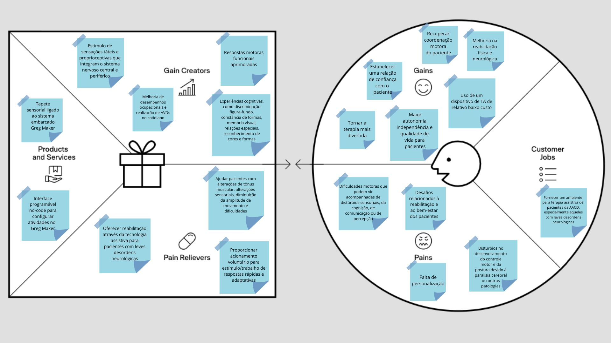
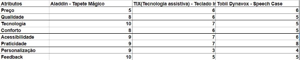
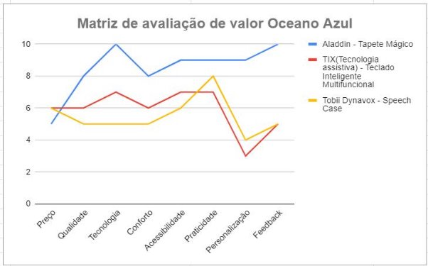
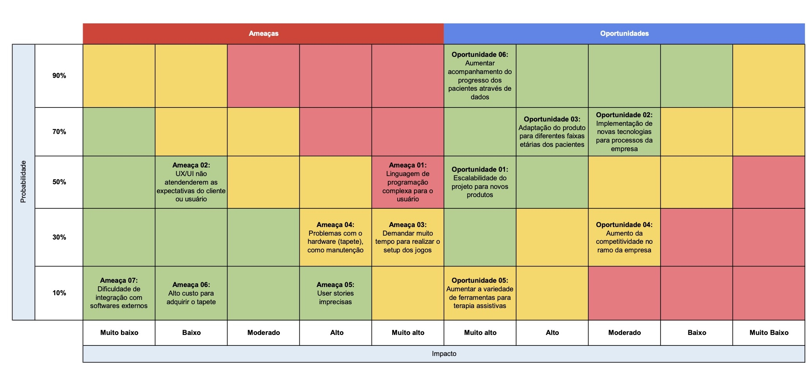

# Entendimento de negócio

# 1 Canvas Proposta de Valor

# 2 Total Addressable Market, Service Addressable Market, e Service Obtainable Market

## 2.1 Total Addressable Market (TAM):

O TAM representa a totalidade do mercado potencial em termos de receita para um produto ou serviço. Segundo a Pesquisa Nacional por Amostra de Domicílios (PNAD): Pessoas com Deficiência 2022 (IBGE, 2023), existem 18,6 milhões de pessoas (8,9% da população total) de 2 anos ou mais de idade com deficiência no Brasil em 2022.

Para o tapete tátil com sistemas embarcados, voltado para pessoas com deficiência, o TAM pode ser derivado desse total. Considerando que o custo estimado de produção do tapete tátil de 800 reais (conforme análise financeira adiante) e um preço de 1.000 reais, o TAM seria de aproximadamente R$ 18,6 bilhões de reais.

No entanto, é crucial ressaltar que nem todos precisariam ou teriam acesso a este produto.O TAM é uma estimativa idealizada e, nesse contexto, representa o potencial máximo se todos esses indivíduos fossem alcançados pelo produto.

## 2.2 Service Addressable Market (SAM):

O SAM refere-se à parte do TAM que é realista para uma empresa alcançar com seu produto ou serviço específico, levando em consideração fatores como geografia e capacidade de entrega. Para o nosso projeto, estamos segmentando o mercado com foco em pessoas com deficiências motoras e visuais. Com base nos dados disponíveis na PNAD, estimamos que 9,4% do TAM (ou cerca de 1,74 milhão de pessoas) seria o número de clientes em potencial, pois é o número estimado pela PNAD de pessoas com deficiência entre 2 a 19 anos. Nesse cenário, nosso SAM seria de aproximadamente R$ 1,74 bilhão de reais.

## 2.3 Service Obtainable Market (SOM):

O SOM é a porção do SAM que pode ser realista e efetivamente alcançada por uma empresa, considerando restrições como capacidade operacional e concorrência. Para determinar o SOM, analisamos a capacidade de produção e distribuição do tapete tátil, a aceitação prevista do mercado, e a diferenciação do produto.

Com esses fatores em mente, projetamos que podemos capturar 60% do SAM, resultando em aproximadamente 1 milhão de pessoas. A AACD, ao atender 542.677 pessoas no ano de 2022, conforme informações disponíveis em seu site oficial ([AACD](https://aacd.org.br/)), fornece um número que se aproxima desse número.

Tendo esses dados em mente, o SOM estimado para o tapete tátil com sistemas embarcados é de aproximadamente 1 bilhão de reais.

Estas são estimativas iniciais, e para uma análise precisa, é imperativo conduzir uma pesquisa de mercado aprofundada. Essa pesquisa deve considerar aspectos como aceitação do produto, capacidade de produção e distribuição, concorrência no mercado de tecnologias assistivas, e outros fatores limitantes, como preço, barreiras geográficas e regulamentações. Ao utilizar fontes confiáveis e dados atualizados, podemos refinar ainda mais estas estimativas para fornecer uma visão clara do potencial de mercado para o tapete tátil com sistemas embarcados.

## 2.4 Referências:

- Instituto Brasileiro de Geografia e Estatística (IBGE). [Pesquisa Nacional por Amostra de Domicílios (PNAD): Pessoas com Deficiência 2022](https://agenciadenoticias.ibge.gov.br/agencia-noticias/2012-agencia-de-noticias/noticias/37317-pessoas-com-deficiencia-tem-menor-acesso-a-educacao-ao-trabalho-e-a-renda). Acesso em: 24/10/2023.

- Associação de Assistência à Criança Deficiente (AACD). [Site oficial](https://aacd.org.br/). Acesso em: 24/10/2023.

#  3 Matriz de avaliação de valor Oceano Azul
**Matriz de oceano azul**

A matriz de oceano azul é uma ferramenta estratégica que ajuda as organizações a escaparem do chamado “oceano vermelho”. O oceano como pode ser visto, é utilizado como uma metáfora, onde existem os tubarões definidos como empresas grandes, enquanto os peixes referem-se às pequenas empresas. O oceano vermelho são ambientes onde a competição é predominante, devido a constante batalha por recursos e a disputa por sobrevivência, este tipo de ambiente gera riscos em que, por analogia, uma empresa é devorada por outra, ou seja, a concorrência se sobressai. Observando os prejuízos que a energia botada em um oceano vermelho pode gerar, verificaram que explorar um oceano azul é a melhor alternativa para gerar um ciclo virtuoso, o qual é possível nadar em águas que possuem diversas oportunidades para crescer e ser um diferencial. O oceano azul diz respeito a um ambiente com poucos concorrentes, onde há presença do diferencial e de maiores chances dos clientes estarem alinhados com o que você espera pelo futuro do seu negócio.

Desse modo, a matriz do oceano azul oferece uma visão clara e ampla de características relevantes para o progresso de um negócio enquanto se alinha ao mercado em que se está inserido, para isso possui quatro aspectos, sendo:

|**Eliminar**|Refere-se a quais fatores a empresa/indústria/mercado não utiliza mais e que devem ser eliminados, são fatores que apenas ocupam esforços e tempo e não geram um bom retorno.|
| - | - |
|**Reduzir**|São aqueles fatores que devem ser reduzidos abaixo dos padrões do setor/mercado|
|**Criar**|É o necessário para navegar no oceano azul, diz respeito ao que a empresa e o mercado não oferecem e o que é preciso criar para ter vantagem competitiva.|
|**Elevar**|São fatores que devem ser melhorados, é aquilo que ao ser melhorado, diferencia a empresa ao mesmo tempo que agrega qualidade/valor.|

**Matriz de oceano azul - Projeto Tapete Mágico**

|**Eliminar**| Plano de assinatura|
| - | - |
|**Reduzir**| Uso de aparelhos móveis(tela azul); |
|**Criar**| 
● Feedbacks do progresso de aprendizagem;

 ● Personalização de atividades feitas pelo profissional.
|
|**Elevar**|
● Inovação(tecnologias e funcionalidades); ● Acompanhamento preciso e mais próximo do profissional;

● Conforto através da facilidade de adaptação através de diferentes estímulos;

●Garantir maior acessibilidade com atividades adaptadas ao perfil do paciente.
|

O gráfico abaixo demonstra com mais especificidade os atributos que compõem a solução, além da comparação com concorrentes que possuem produtos semelhantes:

[Copy of Matriz Oceano Azul - exemplo.xlsx](https://docs.google.com/spreadsheets/d/1gnIxeNkvrEHYinvOoBEi1wTz4126kh4r/edit?usp=sharing&ouid=103057983775806856099&rtpof=true&sd=true)

Desse modo, após observar os principais atributos, abaixo há uma explicação de cada um deles e a abordagem a respeito da comparação com a concorrência, além de “como” os valores foram declarados a partir da análise de possíveis implementações e de como se diferenciam com o que existe no mercado atualmente:

| **Atributos** | **Concorrência** | **Como** |
|--------------|--------------|--------------|
| Preço | Diferenciar-se dos concorrentes oferecendo um produto que não é utilizado através do modelo de negócio por assinatura, optando por viabilizá-lo por um custo mais acessível que o total(assinatura) calculado no período de um ano em relação à concorrência.| Preço amigável, sem modelo de assinatura e com um valor total mais viável do que a concorrência. |
| Qualidade | Diferente da concorrência há diferentes funções e recursos que podem ser configuradas pelo usuário, esses aspectos também garantem segurança, sem causar danos à integridade emocional devido a algum tipo de estímulo que leva ao desconforto. Tal como apresenta inovação por manter um sistema integrado com o mundo físico e virtual simultaneamente. Além disso, a interface intuitiva não é apenas para o paciente, como também para o profissional, permitindo que ambos compreendam e utilizem com facilidade. | 
● Oferece uma experiência mais envolvente através da atuação do profissional nas atividades de desenvolvimento;

 ● Interface intuitiva, o qual o profissional tem facilidade de uso e a criança ao interagir com o meio físico, entende o que foi proposto pelo profissional através de estímulos ajustados ao seu perfil;

 ● Resultados mensuráveis a partir de dados quantificáveis, como melhorias no movimento motor, coordenação das crianças que utilizaram o produto.

 |
| Tecnologia | As tecnologias existentes não possuem a combinação e comunicação do físico e virtual, geralmente a concorrência oferece produtos focados em equipamentos físicos, como teclados ou softwares, como jogos de desenvolvimento cognitivo e não incluem profissionais em seus sistemas.| Integração do melhor que os recursos físicos e virtuais podem oferecer através do software(virtual) e do tapete(físico). |
| Conforto | Despertar um maior interesse através de estímulos ao mesmo tempo em que a interação referente a respostas desses estímulos(visuais, táteis, sonoros), não comprometam o conforto do paciente, deixando-o livre para tomada de decisão e manter uma experiência agradável por meio do atendimento de suas necessidades(personalização). A concorrência possui soluções, mas são padronizadas, se um paciente tem por preferência o contato, uma tela pode comprometer o desenvolvimento tátil e ser desconfortável, assim como estímulos sonoros que podem ser desagradáveis. Além disso, as soluções da concorrência podem não ser tão adequadas para pessoas que possuem limitação física e, por não oferecerem atividades personalizadas, o paciente faz tarefas muitas vezes consideradas monótonas devido à escassez de atividades diversificadas. | Possibilidade de utilizar dados do paciente ao implementar atividades, evitando que fatores desconfortáveis façam parte dessas atividades(principalmente em relação a barulhos). |
| Acessibilidade | Os produtos podem ser considerados acessíveis por possuir recursos gerais que auxiliam o desenvolvimento de um paciente com paralisia cerebral, como controles simples, interface intuitiva e ergonomicamente amigável. Embora sejam funcionais, podem não atender totalmente as necessidades mais específicas de cada paciente, dificultando sua acessibilidade. | Inclui opções para ajustar interfaces e funcionamento das atividades, garantindo uma alta personalização que resulta em uma maior acessibilidade. |
| Praticidade | Um produto não deve ser apenas acessível, deve ser prático e oferecer soluções adaptadas para os pacientes ou profissionais que acompanham esses pacientes. Isso significa que um produto acessível com atividades personalizadas não garante o ajuste conforme o paciente cresce ou suas necessidades mudam, pois pode apresentar problema em se integrar de forma eficiente na vida cotidiana de quem utiliza ao se referir em configuração, uso e manutenção. | Garantir uma configuração fácil do sistema e ao implementar atividades. |
| Personalização | Permitir que o profissional crie tarefas personalizadas de acordo com o perfil do paciente e faça updates dessas atividades conforme o progresso ou necessidades apresentadas ao longo do processo de acompanhamento, visto que a concorrência não permite tal ação por oferecerem produtos com ferramentas e atividades já padronizadas. | Permitir que os profissionais criem atividades com base em seus critérios, eliminando a padronização que torna o processo limitante. |
| Feedback | Oferecer ao longo do acompanhamento, relatórios conforme o histórico de atividade e observações gravados na plataforma pelo profissional, a fim de facilitar a análise de resultados do paciente e montagem/direcionamentos de novas atividades. Em relação a feedbacks, a concorrência apenas utiliza-se de informações transmitidas apenas no momento de interação, sem guardá-los precisamente para utilizá-las como fatores de avaliação. | Oferecer relatórios conforme é feito o acompanhamento da criação. |

# 4 Matriz de Risco

## 4.1 Oportunidades

### Oportunidade 01: Escalabilidade do projeto para novos produtos
Alavancagem: Focar em arquitetura escalável e flexível que permita a expansão para novos produtos e mercados.

### Oportunidade 02: Implementação de novas tecnologias para processos da empresa
Alavancagem: Investir em tecnologias emergentes que possam otimizar os processos internos e melhorar a eficiência operacional.

### Oportunidade 03: Adaptação do produto para diferentes faixas etárias dos pacientes
Alavancagem: Desenvolver adaptações específicas do produto que atendam às necessidades de diferentes grupos etários, aumentando assim o alcance do mercado.

### Oportunidade 04: Aumento da competitividade no ramo da empresa
Alavancagem: Implementar estratégias inovadoras de desenvolvimento de produtos para se destacar no mercado.

### Oportunidade 05: Aumentar a variedade de ferramentas para terapia assistiva
Alavancagem: Expandir a gama de ferramentas oferecidas, capitalizando na diversificação e atendendo a uma gama mais ampla de necessidades terapêuticas.

### Oportunidade 06: Aumentar acompanhamento do progresso dos pacientes através de dados
Alavancagem: Utilizar dados coletados para personalizar e melhorar os planos de tratamento, além de fornecer insights valiosos para os terapeutas e pacientes.

## 4.2 Ameaças

### Ameaça 01: Linguagem de programação complexa para o usuário
Mitigação: Usar linguagens de programação e frameworks mais amigáveis, e proporcionar treinamento adequado para a equipe.

### Ameaça 02: UX/UI não atenderem as expectativas do cliente ou usuário
Mitigação: Realizar testes de usabilidade frequentes e envolver os usuários no processo de design para feedback contínuo.

### Ameaça 03: Demandar muito tempo para realizar o setup dos jogos
Mitigação: Simplificar o processo de instalação e configuração através de guias passo a passo e suporte técnico.

### Ameaça 04: Problemas com o hardware (tapete), como manutenção
Mitigação: Garantir alta qualidade na fabricação e oferecer um plano de manutenção e suporte eficaz.

### Ameaça 05: User stories imprecisas
Mitigação: Melhorar a comunicação e esclarecer requisitos com o parceiro.

### Ameaça 06: Alto custo para adquirir o tapete
Mitigação: Explorar opções para reduzir custos de produção ou fornecedores mais vantajosos.

### Ameaça 07: Dificuldade de integração com softwares externos
Mitigação: Adotar padrões de integração abertos e colaborar com fornecedores de software para garantir compatibilidade.

# 5 Análise financeira

O projeto Tapete Mágico, em parceria com a AACD, abre portas para o uso da tecnologia como ferramenta para auxiliar inúmeras crianças e terapeutas ocupacionais no suporte a pessoas com leves desordens neurológicas. Ao se tratar de uma solução que combina o mundo digital com a eletrônica na implementação de dispositivos físicos, a análise financeira conta com toda a abordagem, desde a plataforma até os componentes físicos.

A AACD não forneceu uma estimativa de quanto têm disponível para investir no projeto. Porém, considerando que ela já realiza um trabalho de terapia ocupacional com o sistema Greg Maker, é possível que os investimentos estimados adiante sejam significativamente reduzidos.

Pretende-se (até o contexto atual da Sprint 1) que uma plataforma nativa para Windows seja desenvolvida. O custo de uma solução como esta pode variar muito de acordo com a região e o escopo do projeto. Apesar de uma solução mais básica em termos de telas, há uma alta complexidade ao envolver o desenvolvimento de uma solução que conta com um compilador e a integração com componentes eletrônicos. Logo, estabeleceu-se, considerando um prazo extremamente curto de apenas 10 semanas, um valor de R$ 80 mil reais para o projeto da plataforma.

Passando para os componentes eletrônicos, o microcontrolador Greg Maker está sendo utilizado, e sua faixa de preço atualmente (26 de outubro de 2023) é de [500 reais por unidade](https://www.gregmaker.com.br/adquirir-o-greg). Embora o tapete sensorial seja altamente personalizável, alguns tapetes prontos estão disponíveis por cerca de R$ 800/unidade. Com o intuito de obter uma quantidade considerável de tapetes úteis para toda a unidade, estipulou-se que cerca de 10 tapetes serão necessários.

Em suma, o valor total de investimento deste projeto é estimado em 88.000 reais, para uma solução que consiste em 10 tapetes sensoriais conectados à plataforma nativa para Windows.

Em relação à receita estimada, por se tratar de um projeto interno da AACD, esse dado não é relevante.

Uma lista de materiais pode ser acompanhada [através desse link](https://docs.google.com/spreadsheets/d/1ZFiTqLNZlBLmzQYdyL4rw4I2294iZFfG/edit?usp=sharing&ouid=106760528618634954678&rtpof=true&sd=true). Por se tratar da primeira sprint, muitos componentes não estão listados por não contemplarem a [arquitetura incial](./img/Arquitetura%20AACD.png).

## 5.2 Referências

BENU EVENTOS. Disponível em: <https://loja.benu.com.br/tapete-sensorial.html>. Acesso em: 26/10/2023.

CRUZ, W. S. DA. Veja quanto custa um software personalizado! Disponível em: <https://www.ubistart.com/blog/quanto-custa-um-software-personalizado/>. Acesso em: 26/10/2023.

ENGRENAR TECNOLOGIA. Disponível em: <https://www.gregmaker.com.br/adquirir-o-greg>. Acesso em: 26/10/2023.

UDS TECNOLOGIA. Quanto custa um software sob medida? Disponível em: <https://uds.com.br/blog/quanto-custa-um-software-sob-medida/>. Acesso em: 26/10/2023.
‌
