# Preparação do ambiente de trabalho no seu computador

Como no Inteli o Windows é o sistema operacional mais comumente utilizado, as instruções deste documente são específicas para computadores com este sistema. A instalação destas ferramentas em computadores com Linux ou MacOS é possível, mas provavelmente será necessário buscar procedimentos específicos para estes sistemas operacionais.

## Instalação do kit de desenvolvimento para as tarefas de programação

As tarefas de programação deste módulo 6 deverão ser desenvolvidas na linguagem de programação Java. Você pode utilizar a IDE de sua preferência, como [IntelliJ](https://www.jetbrains.com/pt-br/idea/), [Eclipse](https://www.eclipse.org/), [NetBeans](https://netbeans.apache.org) ou [VSCode com extensões para Java](https://code.visualstudio.com/docs/languages/java).

O programa será chamado através de script em Python. Caso queira verificar se seu programa será chamado e executado corretamente pela plataforma, instale também o [kit de desenvolvimento Python](https://www.python.org/downloads/).

## Instalação do Git

Caso ainda não tenha o Git instalado no seu computador, faça o [download](https://git-scm.com/downloads) e execute a instalação.

## Instalação do Visual Studio Code

Para o desenvolvimento do projeto sugerimos utilizar o Visual Studio Code devido à sua facilidade de integração com o Git e devido ao grande número de extensões disponíveis (em particular, as extensões relacionadas ao formato Markdown).

Procedimento:

1. Acesse https://code.visualstudio.com/
2. Baixe o instalador indicado.
3. Faça a instalação do programa.
4. Execute o Visual studio Code.
   
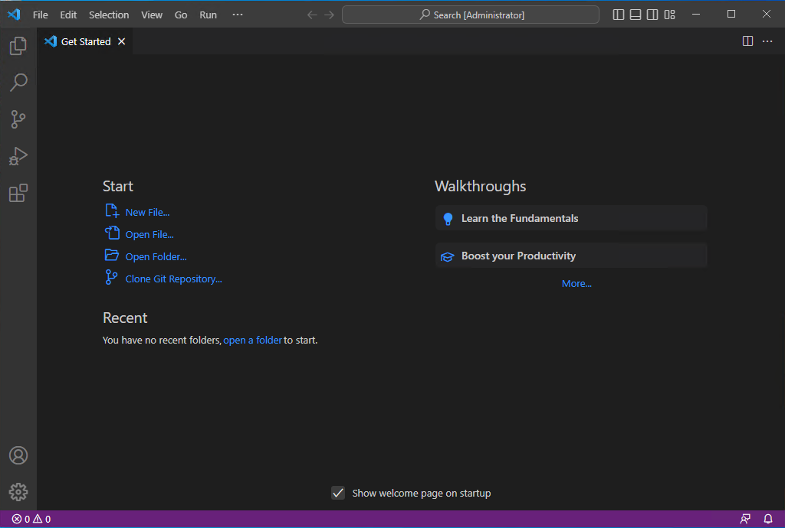
   

## Configuração do Git

Se esta é a primeira vez que você utiliza o Git no seu computador, execute o procedimento a seguir para configurar o usuário e o email.

Procedimento:

1. No Visual Studio Code, abra um terminal.

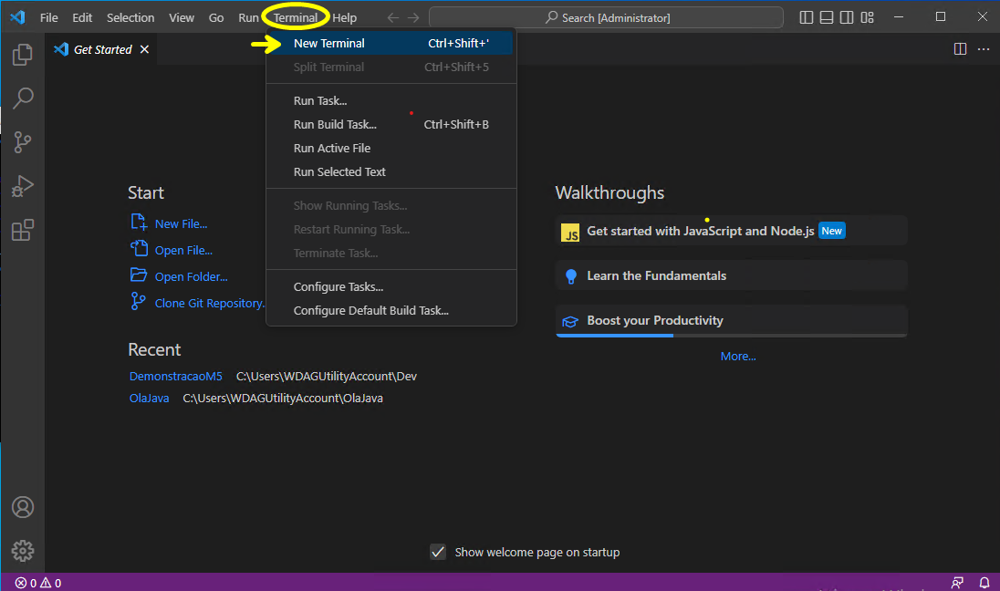

2. Execute os comandos para configurar o seu nome e o seu email.

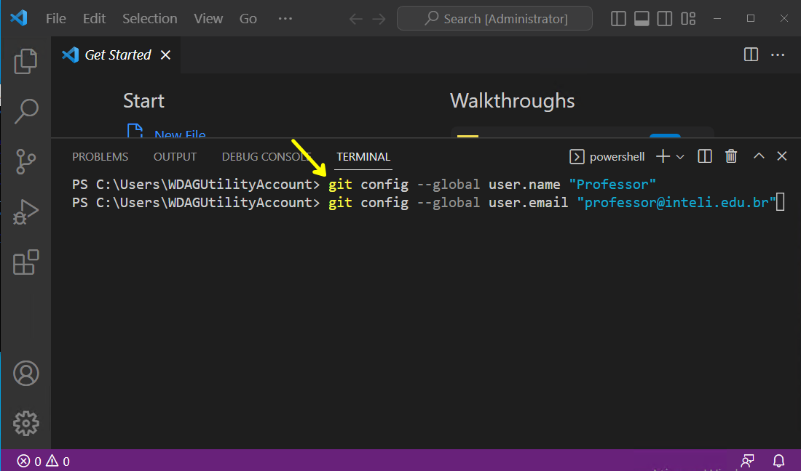

## Instalação da extensão *GitHub Pull Requests and Issues*

1. Execute o Visual Studio Code.
2. Acesse a área das extensões e instale a extensão *GitHub Pull Requests and Issues*.

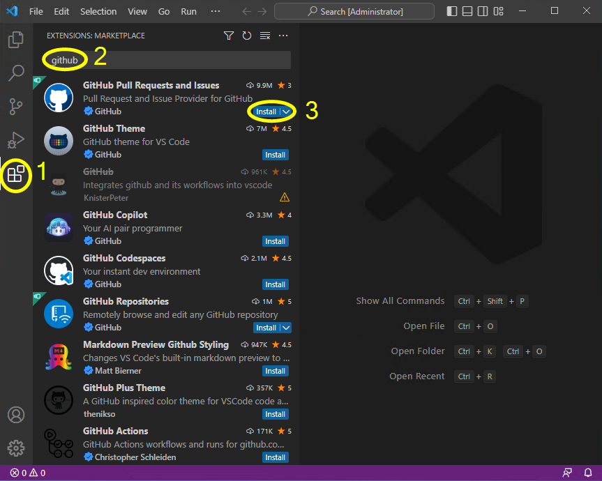

## Instalação das extensões do Visual Studio Code para o desenvolvimento Java

Faça a instalação das extensões do Visual Studio Code para o desenvolvimento de aplicações na plataforma Java.

Procedimento:

1. Execute o Visual Studio Code.
2. Acesse a área das extensões e instale o *Extension Pack for Java*.

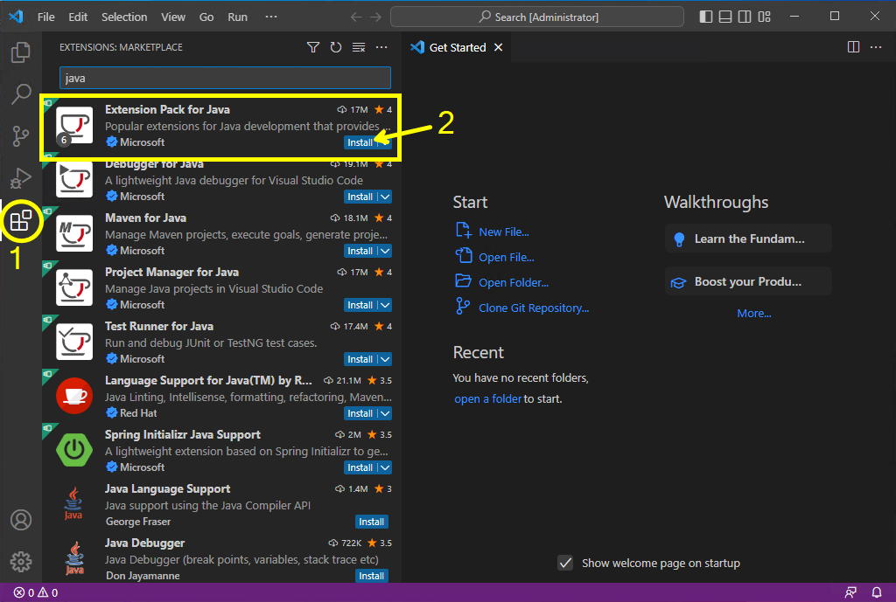

3. Para testar o ambiente de desenvolvimento, crie um novo projeto Java.

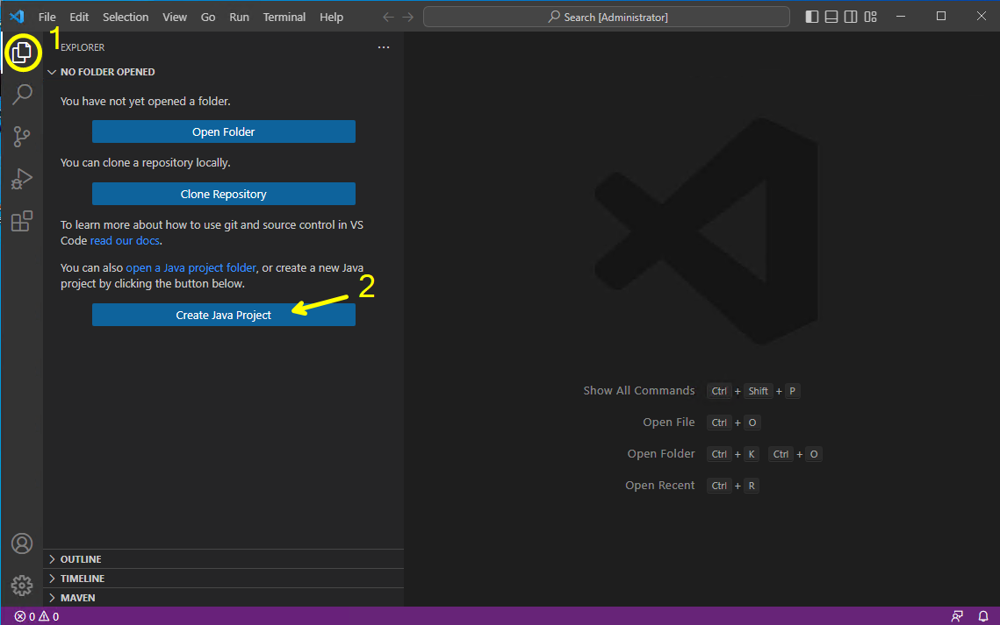

4. Para este primeiro teste, seleciona a opção *No build tools*.

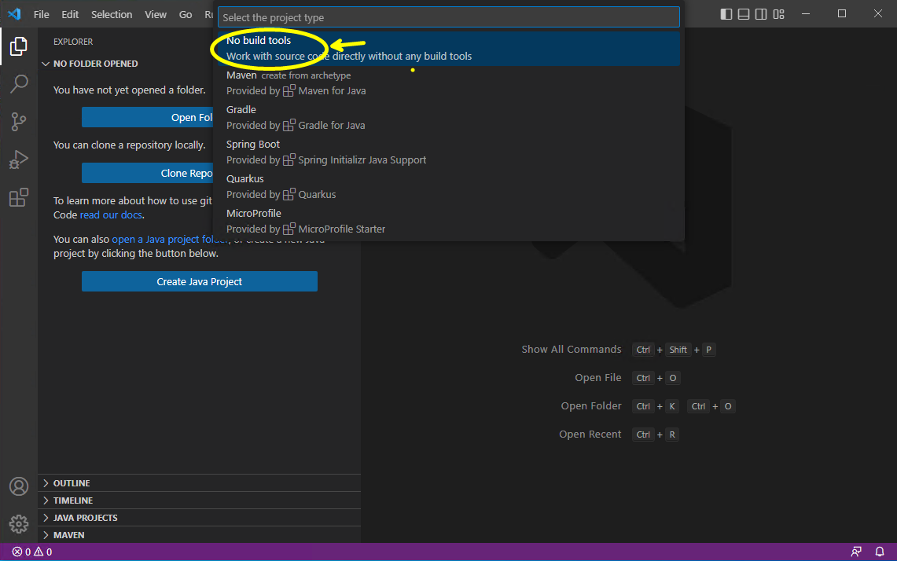

5. Crie e selecione a pasta para o projeto.

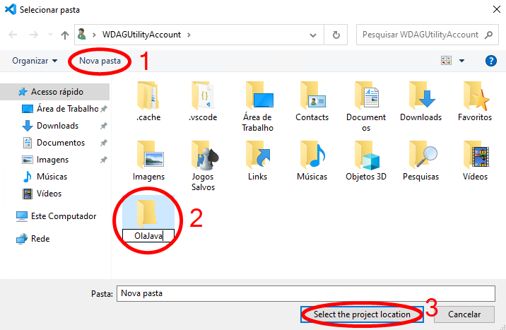

6. Defina o nome do projeto.

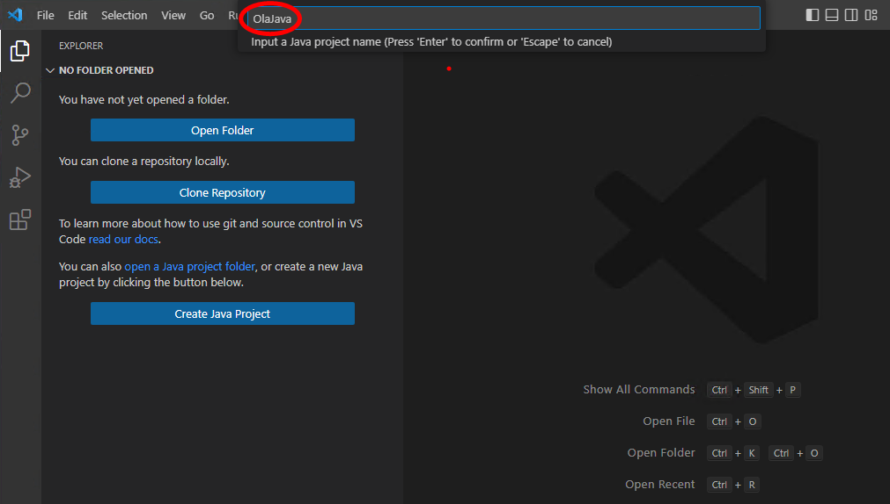

7. Execute o programa-exemplo e verifique se a execução é bem-sucedida.

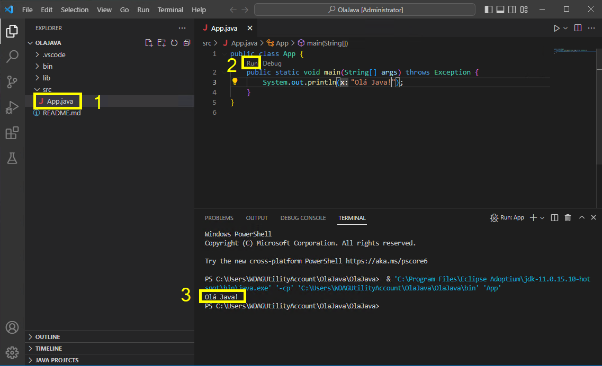

## Instalação das extensões do Visual Studio Code para a elaboração da documentação

A documentação do projeto utiliza o formato Markdown. Para tornar mais conveniente a edição de arquivos neste formato, vamos instalar no Visual Studio Code algumas extensões específicas para Markdown.

Procedimento:

1. Execute o Visual Studio Code.

2. Acesse a área das extensões e instale o *Markdown All in One*.

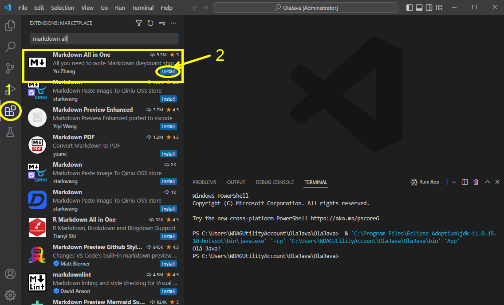

## Instalação de outras extensões

Acesse a área das extensões e instale o *Live Server*.

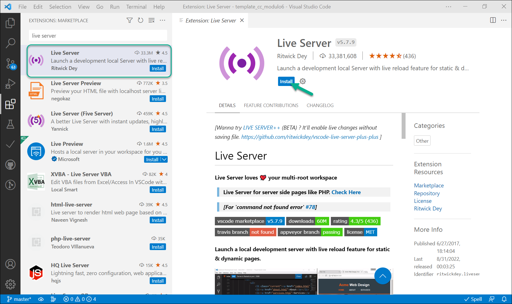

## Instalação das extensões e das ferramentas para a elaboração do artigo

Neste módulo cada grupo deverá redigir um texto descrevendo os resultados do projeto no formato de um artigo científico. O conteúdo deste artigo será editado no formato Markdown, mas a geração do artigo em um formato próximo ao solicitado pelas publicações científicas será realizado utilizando as ferramentas LaTeX e pandoc.

Procedimento:

1. Acesse https://pandoc.org/installing.html e, a seguir, baixe e instale a ferramenta **pandoc**.

2. Acesse https://miktex.org/download e, a seguir, baixe e instale o sistema básico TeX/LaTeX.

3. Execute o Visual Studio code e, a seguir, acesse a área das extensões e instale o [*vscode-pandoc*](https://marketplace.visualstudio.com/items?itemName=ChrisChinchilla.vscode-pandoc) (instale a que tem como autor o *Chris Chinchilla*).

4. Ainda no Visual Studio Code, instale a extensão [*vscode-pdf*](https://marketplace.visualstudio.com/items?itemName=tomoki1207.pdf) (instale a que tem como autor o *tomoki1207*).

## Próximos passos

Após a instalação de todos os itens deste documento, vá para a página com os [procedimentos de validação do ambiente](./validacao_aluno.md).