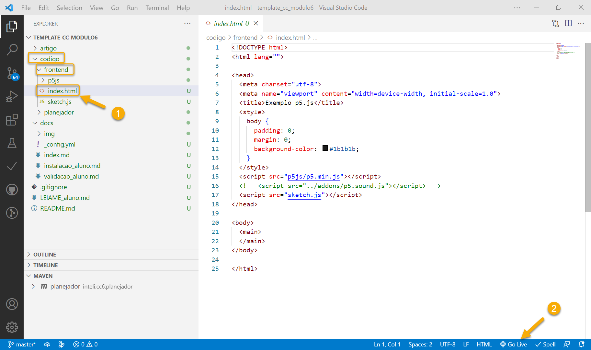
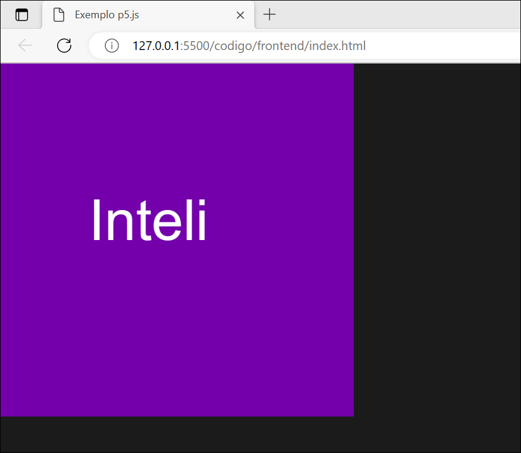
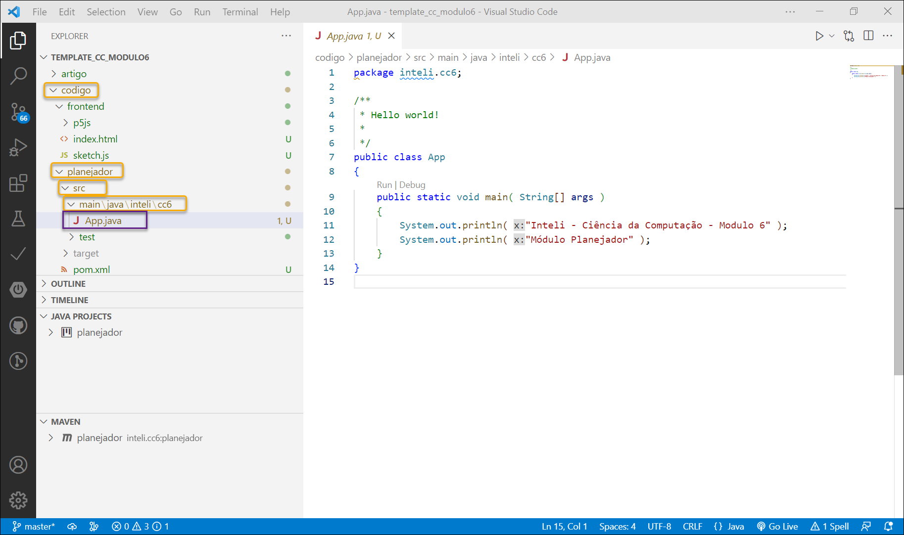
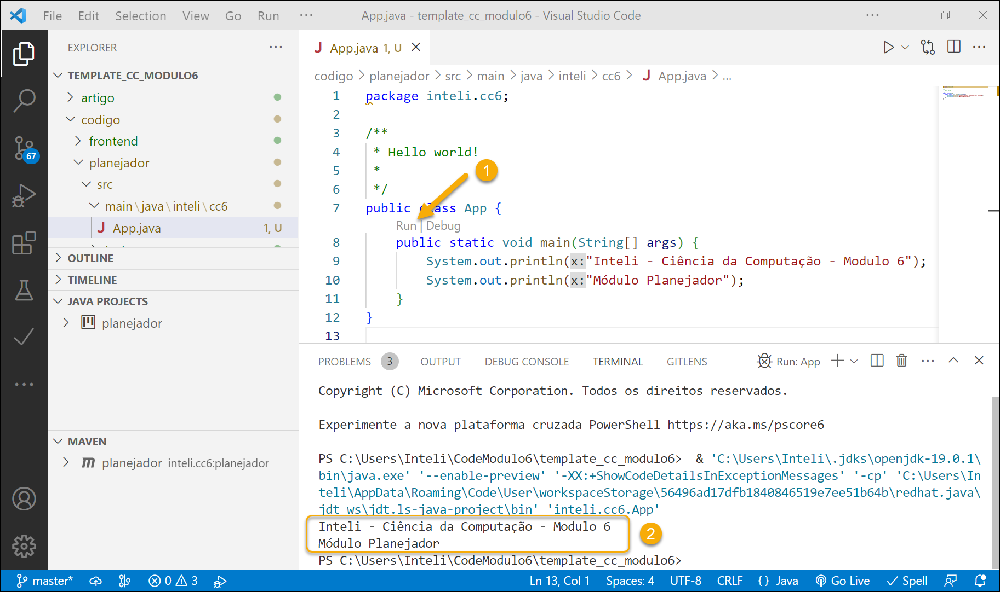
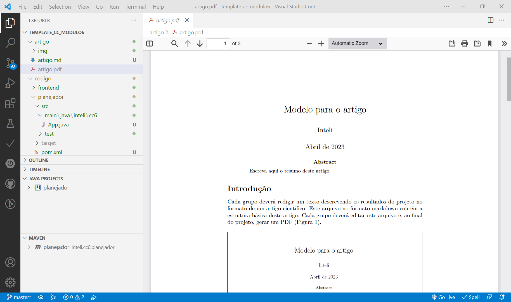

# Validação da preparação no seu computador

Após realizar a [instalação do ambiente no seu computador](instalacao_aluno.md), faça os procedimentos de validação que estão nesta página.

Comece fazendo no seu computador um clone deste repositório.

## Validação da execução do front-end

1. No Visual Studio Code, navegue até o arquivo **index.html** que está na pasta **/codigo/frontend** e ative a opção **Go Live**.

2. Verifique se o navegador abre a página através do servidor local.

## Validação da execução do planejador

1. No Visual Studio Code, navegue até o arquivo **App.java** que está na pasta **/codigo/planejador/src/main/java/inteli/cc6**.

1. Acione a operação *Run* e verifique o resultado da execução.

## Validação da geração do artigo

O artigo é editado no formato *Markdown*, mas é possível gerar um arquivo PDF com uma formatação próxima à utilizada em publicações científicas.

Procedimento para gerar o artigo em PDF:

1. No Visual Studio Code, vá até a pasta `/artefatos` e abra o arquivo `artigo.md`.

2. Pressione o atalho **Ctrl+K P** (pressione simultaneamente **Control** e **K**, solte, e a seguir pressione **P**). Escolha a opção **pdf renderer**.

1. Abra o arquivo **artigo.pdf** e verifique o resultado.

